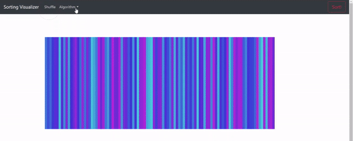

# Sorting visualizer

This project sets to visualize various sorting algorithms in the form of a colour spectrum.

## Meet the Algorithms (Implemented So far):

1. Bubble Sort: A naive O(n^2) algorithm which just swaps everytime an inversion is found

2. Selection Sort: Another O(n^2) algorithm which finds the minimum element every time and swaps it with the first element

3. Insertion Sort: An O(n^2) algorithm that maintains a sorted and unsorted array and inserts every element in its place in the sorted array.

4. Heap Sort: O(nlogn) algorithm that maintains a heap and gets the minimum element each time

5. Merge Sort: O(nlogn) Divide and Conquer

6. Quick Sort: [Last element taken as pivot] Worst Case O(n^2), Amortized O(nlogn)

7. Radix Sort: An improvement over the counting sort using digit-wise sorting. 

